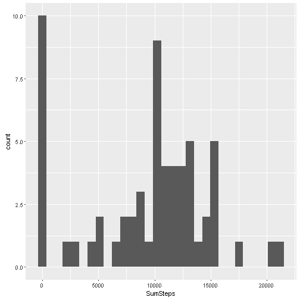
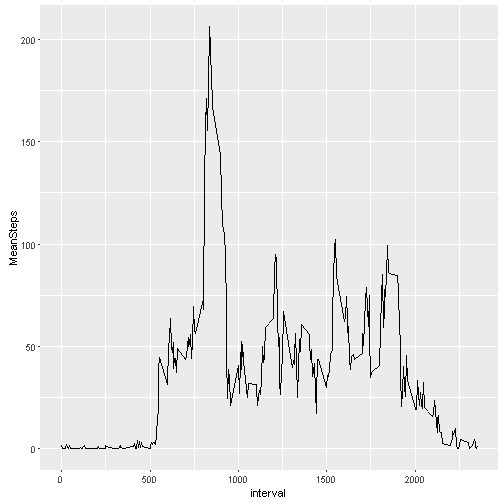
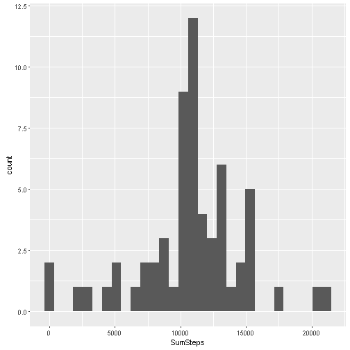
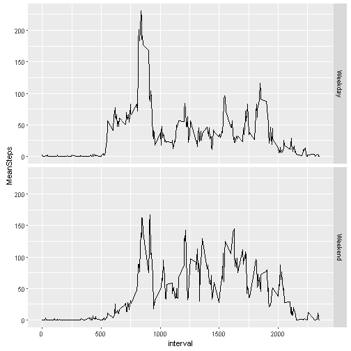

## 1. Loading and preprocessing the data

Firstly, I download the zip data from website and unzip it. Then load the data into R

```r
if(!file.exists('./data')) dir.create('./data')
Url <- 'https://d396qusza40orc.cloudfront.net/repdata%2Fdata%2Factivity.zip'
download.file(Url, destfile = './data/Activity.zip')         # Download
unzip(zipfile = './data/Activity.zip',exdir = "./data")      # Unzip
activity <- read.csv('./data/Activity.csv')                  # Load
```

## 2. What is mean total number of steps taken per day?

In this section, we analysis this dataset from two point of view: *date* and *interval*. First, we group the original data by *date* and find the pattern of steps per day.


```r
library(dplyr)
date_Step <- activity %>% group_by(date) %>% summarise(SumSteps = sum(steps, na.rm = TRUE))   # Group by date and calculate total number of steps per day.
library(ggplot2)   
ggplot(date_Step, aes(x = SumSteps)) + geom_histogram(bins = 30) # View by histogram
```



```r
c(mean(date_Step$SumSteps), median(date_Step$SumSteps))  # Mean and Median of total number of steps per day
```

```
## [1]  9354.23 10395.00
```

## 3. What is the average daily activity pattern?

Then we group data by *interval* and find some pattern of steps per interval.

```r
by_interval <- activity %>% group_by(interval)   # Group by interval
interval_Step <-  by_interval %>% summarise(MeanSteps = mean(steps, na.rm = TRUE))  # Average number of steps per interval
ggplot(interval_Step, aes(x = interval, y = MeanSteps)) + geom_line() # View by time series plot
```



```r
intervalInx <- which.max(interval_Step$MeanSteps)  
by_interval$interval[intervalInx]   # Interval contains maximum steps
```

```
## [1] 835
```

## 4. Imputing missing values


```r
rowName_NA <- which(is.na(activity$steps))
total_NA <- length(rowName_NA)  # Total number of NAs
merge_interval <- merge(activity, interval_Step, by = 'interval')
rowInterval_NA <- which(is.na(merge_interval$steps))
merge_interval$steps[rowInterval_NA] <- merge_interval$MeanSteps[rowInterval_NA]  # Use the mean for interval to impute missing values
new_activity <- merge_interval %>% arrange(date) %>% select(-MeanSteps) %>% select(steps, date, interval)  # New dataset without missing values
date_NewStep <- new_activity %>% group_by(date) %>% summarise(SumSteps = sum(steps, na.rm = TRUE))  # Group by date and get total number of steps per day
ggplot(date_NewStep, aes(x = SumSteps)) + geom_histogram(bins = 30)  # View by histogram
```



```r
c(mean(date_NewStep$SumSteps), median(date_NewStep$SumSteps)) # Mean and Median
```

```
## [1] 10766.19 10766.19
```


```r
by_Newinterval <- new_activity %>% group_by(interval)
interval_NewStep <- by_Newinterval %>% summarise(MeanSteps = mean(steps, na.rm = TRUE))  # Group by interval and get mean
ggplot(interval_NewStep, aes(x = interval, y = MeanSteps)) + geom_line()  # View by time series plot
```


```r
intervalNewInx <- which.max(interval_NewStep$MeanSteps)
by_Newinterval$interval[intervalNewInx] # Interval contains maximum steps
```

```
## [1] 835
```

## 5. Are there differences in activity patterns between weekdays and weekends?


```r
# Create a new factor variable in the dataset with two levels ¨C ¡°weekday¡± and ¡°weekend¡± 
Sys.setlocale("LC_TIME", "English")
```

```
## [1] "English_United States.1252"
```

```r
WW_new_acticity <- new_activity %>% mutate(WW = ifelse(weekdays(as.Date(date)) %in% c("Monday", 'Tuesday', 'Wednesday', 'Thursday', 'Friday'), 'Weekday', 'Weekend')) # Set a new feature 
WW_interval_Steps <- WW_new_acticity %>% group_by(WW, interval) %>% summarise(MeanSteps = mean(steps))  # Group by weekday or weekend
P <- ggplot(WW_interval_Steps, aes(x = interval, y = MeanSteps)) + geom_line() + facet_grid(WW ~.) # Plot weekday and weekend separatly
P
```


